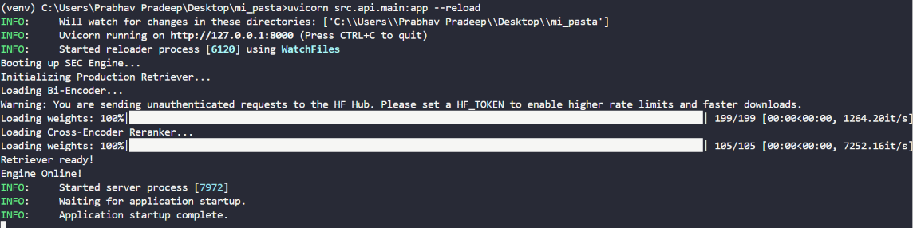

# SEC Financial Filings RAG Engine

> A production-grade, zero-cost, local Retrieval-Augmented Generation (RAG) pipeline built to eliminate hallucination when querying SEC 10-K/10-Q financial filings.

---

## Architectural Blueprint & Engineering Rationale

This project bypasses black-box API wrappers, implementing a modular information retrieval and generation pipeline from scratch:

```text
SEC Filing (HTML) → Chunking (tiktoken) → FAISS (Dense) + BM25 (Sparse)
                                                 │
                                                 ▼
User Prompt → Hybrid Retrieval → RRF Fusion → Cross-Encoder Reranker
                                                 │
                                                 ▼
FastAPI Server ← Llama 3.2 (Ollama) ← Grounded Context + Inline Citations
```

### 1. Ingestion & Structure-Aware Chunking

- **What I did:** Parsed raw SEC HTML filings and used OpenAI's `tiktoken` to slice text at exact token boundaries.
- **Why:** Financial documents rely heavily on tabular data and nested metrics. Standard chunkers slice mid-table and corrupt numerical integrity; our structure-aware approach keeps financial Markdown blocks atomic.

### 2. Hybrid Retrieval (Dense + Sparse Search)

- **What I did:** Paired a dense vector index via FAISS (`BAAI/bge-small-en-v1.5`) with a parallel sparse keyword index via BM25.
- **Why:** Dense embeddings capture semantic meaning (e.g. "regulatory liabilities"), but fail on exact financial identifiers such as specific alphanumeric line items, product codes, or dollar amounts. Combining them ensures the engine never misses context due to vocabulary mismatch.

### 3. Reciprocal Rank Fusion (RRF) & Cross-Encoder Reranking

- **What I did:** Merged sparse and dense retrieval lists using Reciprocal Rank Fusion (RRF), then passed the top candidates through a deeper cross-encoder (`ms-marco-MiniLM-L-6-v2`) to score query-document pairs jointly.
- **Why:** RRF safely normalizes scores across fundamentally different metric spaces without hyperparameter tuning, while the cross-encoder eliminates noisy chunks by performing deep semantic attention scoring before generation.

### 4. Grounded Generation & Guardrails

- **What I did:** Routed top-ranked chunks into a local **Llama 3.2** instance via Ollama with strict prompt guardrails.
- **Why:** Enterprise financial applications cannot tolerate hallucinations. The model is forced to output strict bracketed source attributions (`[Chunk ID]`) and execute zero-knowledge fallback refusals whenever the retrieved context lacks sufficient data.

### 5. Automated Evaluation (RAGAS)

- **What I did:** Built an automated LLM-as-a-Judge evaluation harness using RAGAS to quantitatively score *Faithfulness* and *Answer Relevancy*.
- **Why:** Manual testing does not scale. Quantitative metrics allow continuous verification of pipeline reliability against a golden test dataset.

### 6. Production API (FastAPI)

- **What I did:** Wrapped the pipeline into an asynchronous FastAPI server with Pydantic validation and auto-generated Swagger documentation (`/docs`).
- **Why:** Transitions the codebase from a static research script into production-ready software capable of handling real-time web requests.

---

## Demo

**Server startup — engine boot, retriever init, and model loading:**



**FastAPI Swagger docs — live query walkthrough:**

<!-- TODO: add GIF of the /docs Swagger UI walkthrough here -->


---

## Tech Stack

| Component | Technology |
|---|---|
| LLM Engine | Ollama (`llama3.2`) |
| Embeddings | HuggingFace `BAAI/bge-small-en-v1.5` |
| Reranker | `cross-encoder/ms-marco-MiniLM-L-6-v2` |
| Indices & Storage | FAISS, Rank-BM25 |
| Evaluation Framework | RAGAS, Datasets |
| Server Framework | FastAPI, Uvicorn, Pydantic |

---

## Repository Structure

```text
├── data/               # Raw SEC filings, indices, and evaluation reports
├── src/
│   ├── ingestion/      # SEC downloader, parser, and tiktoken chunker
│   ├── retrieval/      # Hybrid retriever (FAISS + BM25 + RRF + Cross-Encoder)
│   ├── generation/     # Grounded LLM generator & prompt guardrails
│   ├── evaluation/     # RAGAS automated QA harness
│   └── api/            # FastAPI asynchronous REST endpoints
├── requirements.txt
└── README.md
```

---

## Quickstart Guide

```bash
# Clone the repository
git clone https://github.com/YOUR_USERNAME/sec-financial-rag.git
cd sec-financial-rag

# Setup environment
python -m venv venv
source venv/bin/activate  # On Windows: venv\Scripts\activate
pip install -r requirements.txt

# Ensure Ollama is running locally with Llama 3.2
ollama run llama3.2

# Launch the API server
uvicorn src.api.main:app --reload
```

Navigate to [http://127.0.0.1:8000/docs](http://127.0.0.1:8000/docs) to test queries via the interactive Swagger UI.